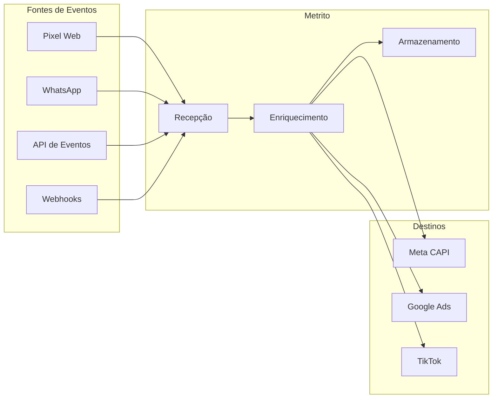

## O que é o Rastreamento do Metrito?

O Metrito é uma plataforma de atribuição de marketing que captura toda interação que um usuário tem com a sua marca — da primeira visita anônima até a compra final — e une tudo em uma jornada de cliente unificada.

Diferente de ferramentas básicas de analytics, o Metrito:

- **Rastreia em múltiplos canais**: Web, WhatsApp, e-commerce e integrações personalizadas
- **Resolve identidade**: Conecta visitas anônimas a contatos identificados por e-mail, telefone e outros identificadores
- **Atribui receita**: Liga cada compra à campanha, conjunto de anúncios e criativo exato que a gerou
- **Envia conversões**: Repassa eventos para Meta, Google e TikTok para otimização de anúncios

## Conceitos Fundamentais

### Projeto

Um **projeto** representa a sua marca dentro do Metrito — é onde ficam todas as configurações do seu negócio: moeda, fuso horário, domínios, integrações de rastreamento e destinos de conversão.

| Propriedade                         | Descrição                                                         |
| ----------------------------------- | ----------------------------------------------------------------- |
| **ID do Container de Rastreamento** | Identificador único no formato `MTC-XXXXXXX`                      |
| **Moeda**                           | Moeda padrão usada nos relatórios e conversões (ex: BRL, USD)     |
| **Fuso Horário**                    | Fuso horário do negócio para atribuição e relatórios              |
| **Domínio(s)**                      | O(s) domínio(s) do site associado ao projeto                      |
| **Fontes**                          | De onde vêm os eventos (pixel, Shopify, WhatsApp, API)            |
| **Destinos**                        | Para onde os eventos são enviados (Meta CAPI, Google Ads, TikTok) |

Cada evento, lead e sessão pertence a exatamente um projeto. Os dados nunca se misturam entre projetos diferentes.

<Note>
  Internamente, o projeto também é chamado de **contêiner** — você verá esse termo na documentação técnica e na API. O ID no formato
  `MTC-XXXXXXX` identifica o seu projeto em todos os lugares.
</Note>

### Eventos

Um **evento** é uma ação individual do usuário: visualização de página, envio de formulário, clique em botão ou compra.

```json
{
  "domain": "sujaloja.com.br",
  "config": {
    "name": "Compra",
    "facebook": { "name": "Purchase" }
  },
  "data": {
    "value": 299.9,
    "currency": "BRL"
  },
  "lead": {
    "email": "cliente@exemplo.com",
    "phone": "+5511999999999"
  }
}
```

### Sessões

Uma **sessão** é um período de atividade do usuário no seu site (timeout padrão de 30 minutos). As sessões agrupam eventos relacionados e registram o contexto de cada visita:

- URL de entrada e referenciador
- Parâmetros UTM (fonte, campanha, conteúdo, termo)
- Tipo de dispositivo, navegador e sistema operacional
- Localização geográfica (país, cidade, região)

Um mesmo usuário que visita seu site na segunda-feira e volta na quinta-feira terá duas sessões distintas.

### Jornadas

Uma **jornada** representa o caminho completo de um usuário pelo seu funil de marketing, abrangendo múltiplas sessões ao longo de dias ou semanas.

Características principais:

- Pode começar de forma **anônima** (apenas um identificador de navegador)
- Torna-se **identificada** quando e-mail ou telefone é capturado
- Registra atribuição de **primeiro toque** e **último toque**
- Jornadas separadas são **unificadas** quando o sistema descobre que pertencem à mesma pessoa

### Identificação do Usuário

O Metrito conecta automaticamente todas as interações de um mesmo usuário — mesmo que elas aconteçam em canais diferentes e em momentos distintos.

Quando o sistema identifica que dois registros pertencem à mesma pessoa (por e-mail, telefone ou outros identificadores compartilhados), ele unifica o histórico completo: visitas ao site, conversas no WhatsApp, formulários preenchidos e compras realizadas ficam todos agrupados no mesmo perfil.

Isso significa que a campanha que trouxe o usuário pela primeira vez recebe crédito pela conversão, mesmo que ela tenha acontecido dias depois por outro canal.

## Fluxo dos Dados



1. **Eventos chegam** de qualquer fonte (pixel, WhatsApp, API, webhooks)
2. **Recepção** garante que nenhum evento seja perdido
3. **Enriquecimento** resolve a identidade do usuário, adiciona geolocalização e interpreta UTMs
4. Eventos são **armazenados** e encaminhados para as **plataformas de anúncios**

## O que é Capturado Automaticamente

Com o pixel do Metrito instalado, os seguintes dados são coletados sem nenhuma configuração adicional:

| Dado                                                        | Origem                    |
| ----------------------------------------------------------- | ------------------------- |
| URL, título e referenciador da página                       | Navegador                 |
| Parâmetros UTM (`utm_source`, `utm_campaign`, etc.)         | Query string da URL       |
| IDs de clique das plataformas (`fbclid`, `gclid`, `ttclid`) | Query string da URL       |
| Parâmetros personalizados (`src`, `sck`)                    | Query string da URL       |
| Cookies do navegador (`_fbp`, `_ga`)                        | Cookies de primeira parte |
| Tipo de dispositivo, navegador e SO                         | User-Agent                |
| Geolocalização (país, cidade, região)                       | IP do usuário             |

## Próximos Passos

<CardGroup cols={2}>

<Card title="Instalar o Pixel Web" icon="code" href="/tracking/web-setup">
  Adicione o script de rastreamento ao seu site.
</Card>

<Card title="Configurar UTMs" icon="bullseye-arrow" href="/tracking/utm-configuration">
  Configure os parâmetros das plataformas de anúncios para atribuição.
</Card>

</CardGroup>
