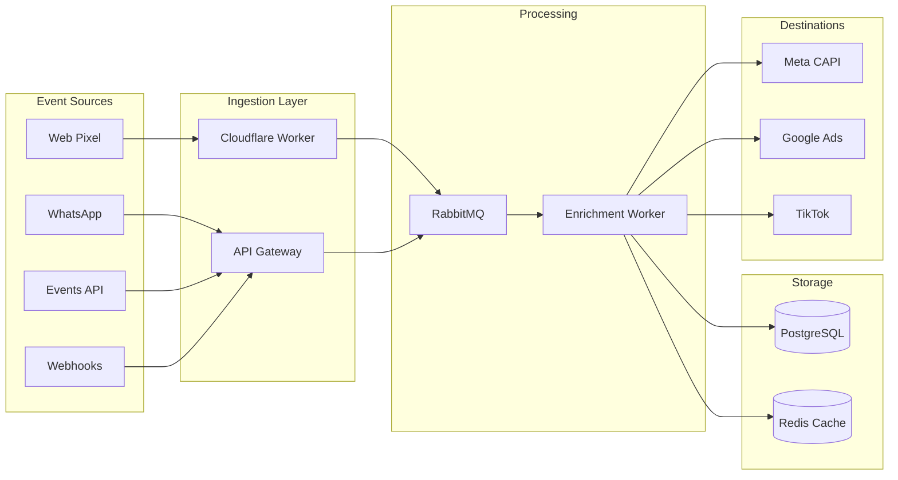

## What is Metrito Tracking?

Metrito is a marketing attribution platform that captures every interaction a user has with your brand — from the first anonymous page view to the final purchase — and connects it all into a unified customer journey.

Unlike basic analytics tools, Metrito:

- **Tracks across channels**: Web, WhatsApp, e-commerce webhooks, and custom integrations
- **Resolves identity**: Links anonymous visits to known contacts using cookies, emails, phones, and bridge identifiers
- **Attributes revenue**: Connects purchases back to the exact ad campaign, ad set, and creative that drove them
- **Sends conversions**: Forwards events to Meta, Google, and TikTok for ad optimization

## Core Concepts

### Container

A **container** is the top-level entity that isolates all tracking data for a single business. Think of it like a Google Tag Manager container.

| Property | Description |
|----------|-------------|
| **Container ID** | Unique identifier in `MTC-XXXXXXX` format |
| **Domain** | The website domain(s) associated with this container |
| **Sources** | Where events come from (pixel, Shopify, WhatsApp, API) |
| **Destinations** | Where events are forwarded (Meta CAPI, Google Ads, TikTok) |

Every event, lead, and session belongs to exactly one container. Data never leaks between containers.

### Events

An **event** is a single user action: a page view, form submission, button click, or purchase.

```json
{
  "domain": "yourstore.com",
  "config": {
    "name": "Purchase",
    "facebook": { "name": "Purchase" }
  },
  "data": {
    "value": 299.90,
    "currency": "BRL"
  },
  "lead": {
    "email": "customer@example.com",
    "phone": "+5511999999999"
  },
  "utm": {
    "utm_source": "facebook",
    "utm_campaign": "Summer Sale|123456789"
  }
}
```

Events are immutable once created and can trigger side effects like contact creation and transaction recording.

### Sessions

A **session** is a time-bounded period of activity (default 30-minute timeout). Sessions group related events and capture context:

- Landing page URL and referrer
- UTM parameters (source, campaign, content, term)
- Device type, browser, and OS
- Geolocation (country, city, region)

Multiple sessions belong to one journey. A user who visits your site Monday and returns Thursday has two separate sessions.

### Journeys

A **journey** represents a user's complete path through your marketing funnel, spanning multiple sessions over days or weeks.

Key characteristics:
- Can start **anonymous** (only a cookie identifier)
- Becomes **identified** when an email or phone is captured
- Tracks **first-touch** and **last-touch** attribution
- Multiple journeys are **merged** when the system discovers they belong to the same person

### Identity Resolution

Metrito uses **pre-computed identity clusters** to link all identifiers belonging to the same person:

```
Identity Cluster: cluster_abc
  ├── email: john@example.com     → journey_123
  ├── phone: +5511999999999       → journey_123
  ├── cookie: abc-def-ghi         → journey_123
  ├── whatsapp_session: wa_abc    → journey_123
  └── fbclid: IwAR1a2b3c          → journey_123
```

Bridge identifiers (cookies, session IDs, click IDs) connect interactions across channels. When a WhatsApp user clicks a link to your website, the `wa_session` parameter links their phone number to the browser cookie — without the identifiers ever appearing in the same event.

## How Data Flows



1. **Events arrive** from any source (pixel, WhatsApp, API, webhooks)
2. **Cloudflare Worker** handles browser events with zero-data-loss queuing
3. **RabbitMQ** buffers events for async processing
4. **Enrichment Worker** resolves identity, adds geolocation, parses UTMs, and creates contacts/transactions as side effects
5. Events are stored in **PostgreSQL** and forwarded to **ad platform destinations**

## What Gets Tracked Automatically

When the Metrito pixel is installed, the following data is captured without any extra configuration:

| Data | Source |
|------|--------|
| Page URL, title, referrer | Browser |
| UTM parameters (`utm_source`, `utm_campaign`, etc.) | URL query string |
| Ad platform click IDs (`fbclid`, `gclid`, `ttclid`) | URL query string |
| Custom tracking params (`src`, `sck`) | URL query string |
| Browser cookies (`_fbp`, `_ga`) | First-party cookies |
| Device type, browser, OS | User-Agent |
| Geolocation (country, city, region) | Cloudflare headers |
| IP address | Request headers |

## Two Systems, Clear Separation

Metrito separates **tracking data** (ephemeral) from **CRM data** (persistent):

| System | Purpose | Retention | Contains |
|--------|---------|-----------|----------|
| **Tracking** | User behavior, attribution, analytics | 3-12 months | Journeys, sessions, events, identity clusters |
| **CRM** | Long-term customer records | Forever | Contacts, transactions, pipeline stages |

Contacts and transactions are created as **side effects** of tracking events — they are not part of the core tracking pipeline. This separation allows aggressive data retention policies on tracking data while keeping customer records indefinitely.

## Next Steps

<CardGroup cols={2}>

<Card title="Install the Web Pixel" icon="code" href="/tracking/web-setup">
  Add the tracking script to your website.
</Card>

<Card title="Configure UTMs" icon="bullseye-arrow" href="/tracking/utm-configuration">
  Set up ad platform parameters for attribution.
</Card>

</CardGroup>
