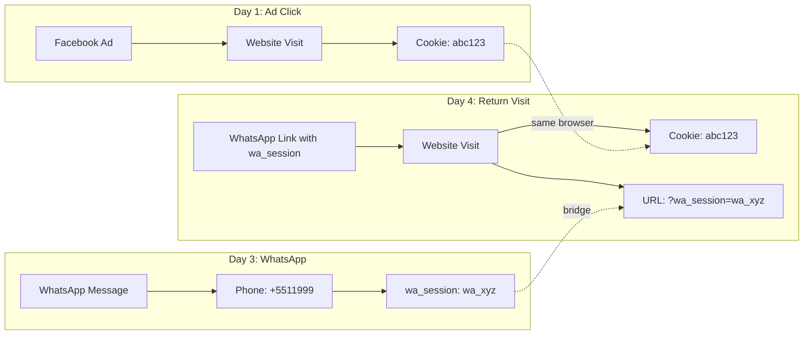

## How WhatsApp Tracking Works

Most customers don't convert on their first visit. A typical journey looks like:

1. User clicks a Facebook ad and lands on your website (web session created)
2. User leaves without converting
3. User contacts you on WhatsApp days later
4. User clicks a link in WhatsApp and returns to the website
5. User purchases

Without cross-channel tracking, step 3 creates a completely separate identity. Metrito solves this by linking WhatsApp conversations to web sessions through **bridge identifiers**.

## Bridge Identifiers

Bridge identifiers are values that exist across channels and allow Metrito to connect them:



On Day 4, the `wa_session` parameter in the URL links the WhatsApp phone number to the browser cookie. Metrito's identity resolution merges both journeys into one:

| Identifier | Source | Linked via |
|------------|--------|------------|
| Cookie `abc123` | Website visit (Day 1) | Direct |
| Phone `+5511999` | WhatsApp (Day 3) | Direct |
| `wa_session: wa_xyz` | WhatsApp (Day 3) | Direct |
| Cookie `abc123` + `wa_session` | Return visit (Day 4) | Bridge |

Result: the Facebook ad gets attribution credit for the WhatsApp-assisted purchase.

## WhatsApp Link Parameters

When sending links from WhatsApp to your website, append the `wa_session` parameter to preserve attribution:

```
https://yoursite.com/checkout?wa_session=wa_xyz123
```

Metrito's tracking script captures this parameter automatically and links the web session to the WhatsApp conversation.

<Tip>
If you use automated WhatsApp tools or chatbots, configure them to append `wa_session` to all outbound links. The session ID should be unique per conversation.
</Tip>

## Cross-Channel Identity Resolution

When Metrito sees identifiers from different channels, it resolves them through identity clusters:

```
Day 1: Website visit
  identifiers: { cookie: "abc123" }
  → Create journey_001, cluster_A

Day 3: WhatsApp message
  identifiers: { phone: "+5511999999999", wa_session: "wa_xyz" }
  → Create journey_002, cluster_B (different person, so far)

Day 4: User clicks WhatsApp link to website
  identifiers: { cookie: "abc123", wa_session: "wa_xyz" }
  → cookie → cluster_A (journey_001)
  → wa_session → cluster_B (journey_002)
  → CONFLICT: merge cluster_A + cluster_B!

Result:
  → Single journey with: cookie + phone + email + wa_session
  → Complete attribution from first ad click to final purchase
```

The merge happens **synchronously** before events are forwarded to destinations like Meta CAPI, ensuring the correct lead ID is sent to ad platforms.

## Metrito Pixel Helper Extension

The **Metrito Pixel Helper** is a Chrome extension that helps you debug and verify tracking in real time, including WhatsApp-originated sessions.

### What It Does

- Detects the Metrito tracking script on any website (both v2 and v3 pixel formats)
- Shows the **Container ID** for the current page
- Displays **lead data** stored in localStorage (`metrito_lead_id`, email, phone, name)
- Intercepts and displays tracking events as they fire (via `sendBeacon` and `fetch`)
- Shows a visual indicator when Metrito is active on a page

### How to Install

1. Download the extension from the Metrito team (or from the Chrome Web Store when available)
2. Go to `chrome://extensions/` in Chrome
3. Enable **Developer mode** (top right)
4. Click **Load unpacked** and select the extension folder
5. The Metrito Pixel Helper icon appears in your toolbar

### Using the Extension

Once installed, navigate to any page with the Metrito pixel:

- A small **Metrito** badge appears in the bottom-left corner of the page confirming detection
- Click the extension icon to see:
  - Whether the Metrito script is detected
  - The container ID
  - Current lead data (ID, name, email, phone)
  - Domain being tracked

When events fire, a toast notification appears in the top-right showing the event name.

### Script Detection

The extension detects Metrito via multiple methods:

| Method | What it checks |
|--------|----------------|
| Script `src` | URLs containing `mtrtprxy`, `mtrttag`, or `metrito` |
| Inline script | v3 IIFE patterns like `o="mtrt"` or `api.metrito.com` |
| Network requests | Requests to `/mtrtprxy/events` or `/mtrt` endpoints |
| localStorage | Keys starting with `metrito_` or `mtrt_` |
| Window object | Presence of `window.mtrt` function |

## WhatsApp Business API Integration

For businesses using the WhatsApp Business API directly (not just WhatsApp Web), Metrito can receive events via webhooks:

```
POST /v1/publish/zap
```

WhatsApp events are processed through Metrito's ingestion pipeline and linked to existing web sessions when bridge identifiers match.

The webhook handler supports message events including:
- Conversation start
- Messages sent and received
- Message status updates (delivered, read)

Contact the Metrito team for WhatsApp Business API webhook configuration.

## Best Practices

1. **Always append `wa_session` to outbound links** — This is the primary bridge between WhatsApp and web
2. **Use the Pixel Helper to verify** — Check that lead data appears after form submissions
3. **Collect email in WhatsApp conversations** — Email is a high-confidence bridge identifier that connects to web sessions even without `wa_session`
4. **Use E.164 phone format** — Always include country code (e.g., `+5511999999999`) for consistent matching

## Next Steps

<CardGroup cols={2}>

<Card title="Events API" icon="terminal" href="/tracking/events-api">
  Send server-side events from any backend system.
</Card>

<Card title="Test Your Setup" icon="bug" href="/tracking/testing">
  Verify cross-channel tracking is working correctly.
</Card>

</CardGroup>
